# %matplotlib inline command 
The %matplotlib inline command is a special directive in Jupyter notebooks that tells the notebook to display matplotlib plots inline, directly within the notebook output cells.

When you run this command:

The plots generated by matplotlib will be displayed below the code cells.
You don't need to call plt.show() explicitly to see the plots. 

# Why this code goes infinite
```
fp = 0
while fp != 1:
    fp = fp + 0.1
```

> Due to how floating-point numbers are represented in computers, the value of fp might never be exactly 1.0, 


# Notes Summary
- you should not try to check for exact equivalence (==) with floats. Instead, you can measure approximate equivalence.
- Associative and Distributive property will not work
>> 1.  x, y, z, (x + y) + z == x + (y + z) = FALSE
>> 2. a, b, c, a * (b + c) == a * b + a * c = FALSE

**Create Array**
```
np.array([1,2,3])
```

**Arithment operation**
```
a_mul_b = a * b
a_plus_b = a + b
a_minus_b = a - b
a_div_b = a / b
a_pow_b = a ** b
```

**Array Operation**


**Diagonal matrix and multiplication**
> np.diag(a)
> a_diag @ A (@ is shortcut for multiplication)

*Example*


**Broadcasting Concept**
Reshape

Reshape with -1


**reshape().shape()**
Gives the shape of the array
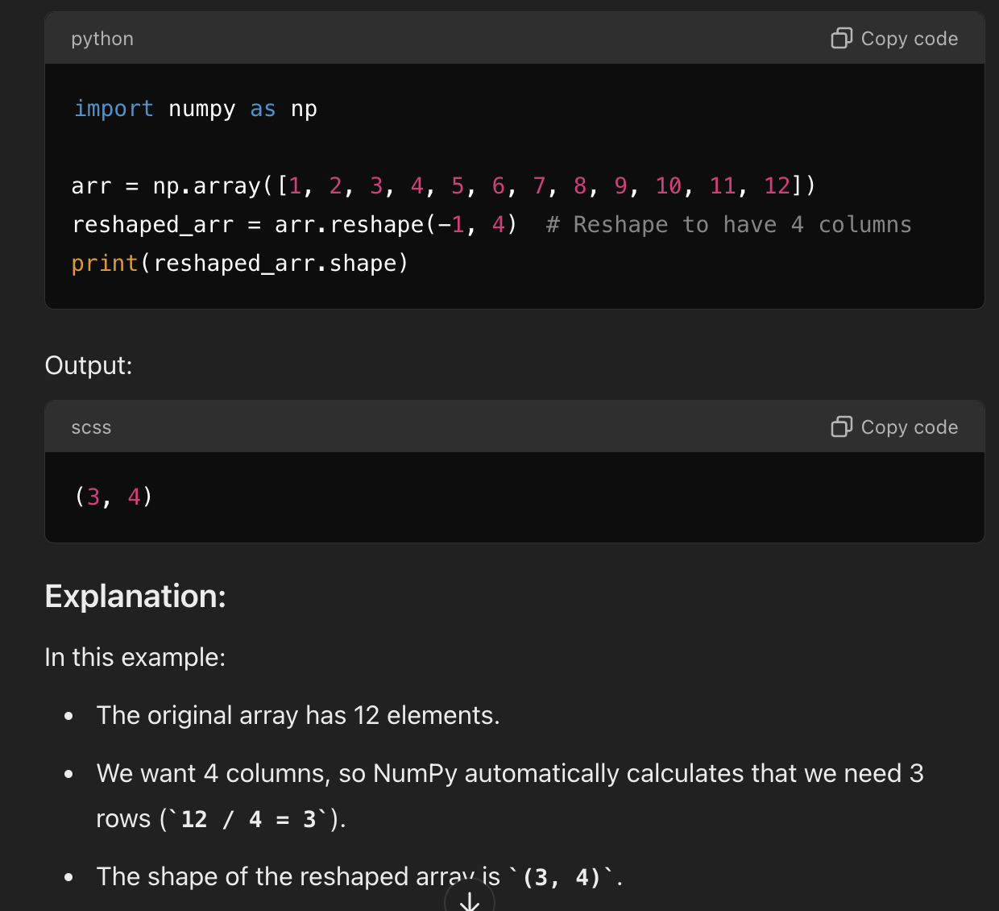

*Note!!!*
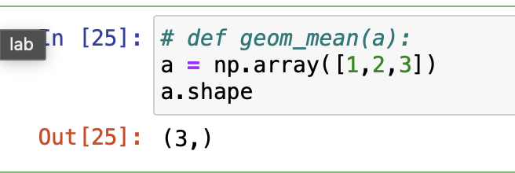
*Use Shape[0] to get shape*

**Matrix Multiplication (@) vs.  Dot matrix (*)**
### Matrix Multiplicaation
> Rule
 >> the number of columns in the first matrix must equal the number of rows in the second matrix.
 *Example*
 

 > This is achieved by "@"
### Element wise Multiplication
> Rule
> > Both arrays must have the same shape or be compatible for broadcasting.
*Sample*


## Numpy Autoscale to fit operations


Note: Row vs. Column Broadcasting
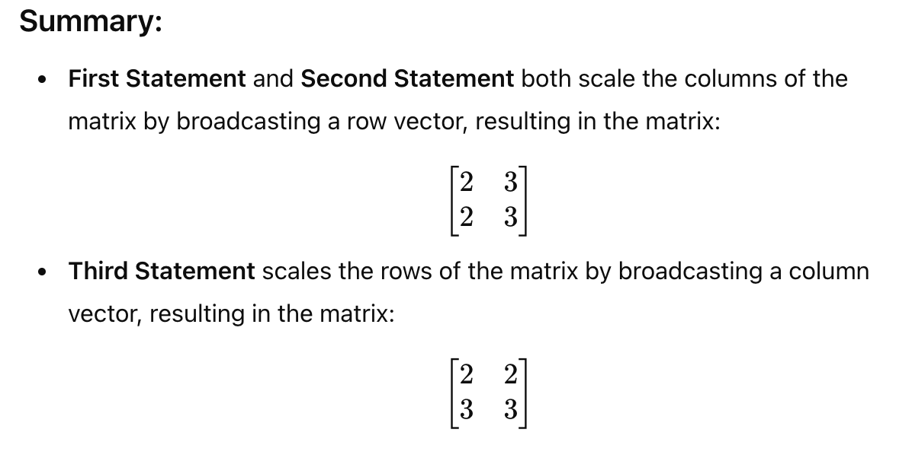
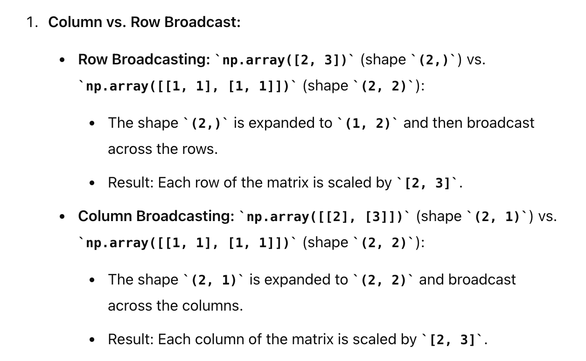

## Power
Use "**"

## To multiple all elements of one array
```
prod(array)
```
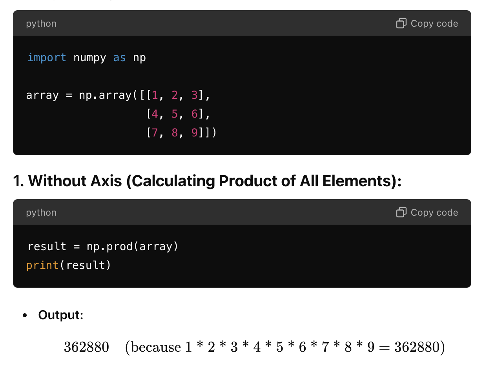
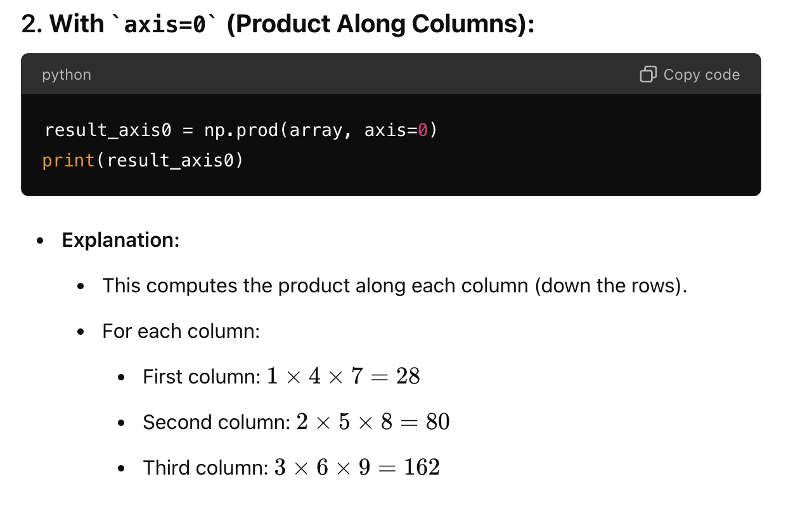
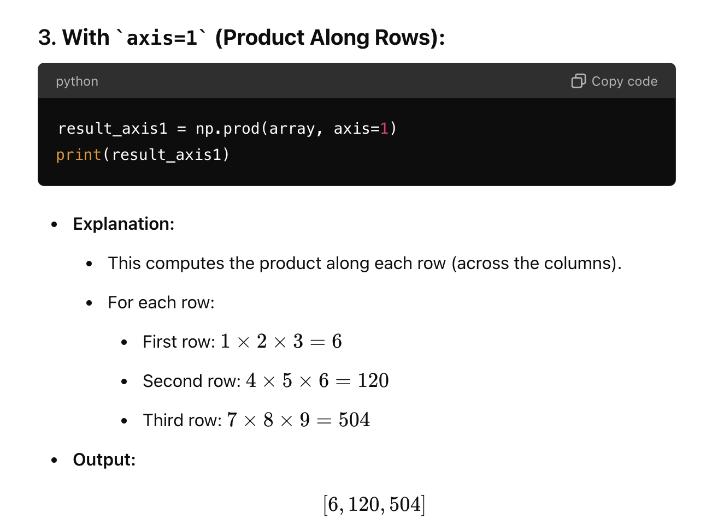

## Square root (Geom_mean)
To achieve

Do..


## Exponents (Multiple to log addition)


> - Multiplication in log is addition
> Square"N" root convert to exp (mean)
From 

to


- Step 3 converts logarithm back to exp.

**What is exp?**

*Sample*
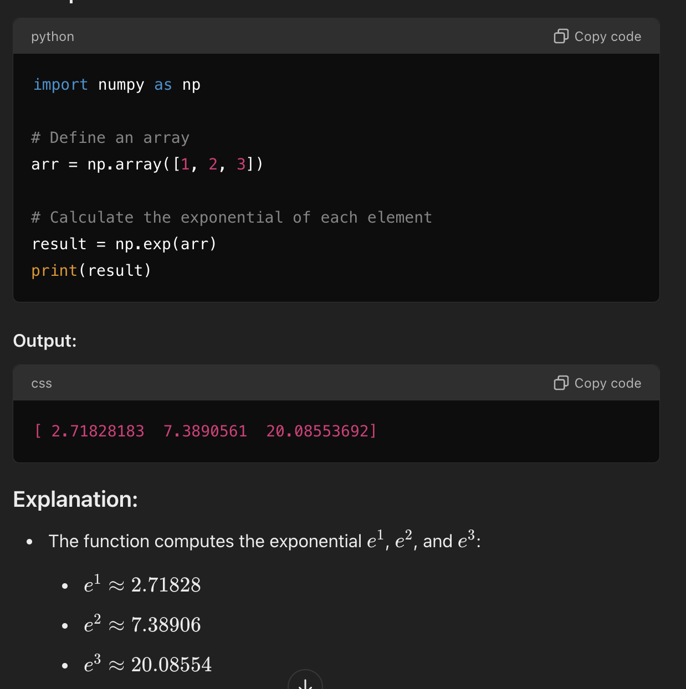

---
# ELEMENTS ADJUSTING/MANIPULATE!
#  Arange
create array starting with "0" and extends to the limit
## ASK:


**NOTE**
- use arrange to create array
- add one as arange starts with 0. use this to create row multipliers and column divisors
- for row multipliers, you should have one column and for column divisors , you should have one row. So use "-1"
  

---
## Basic Indexing
**Step1:Shuffle and setup an array**

**Solution**

*Note*
1. "-5" takes from the last 5 posiitons
## Shuffle
np.random.seed(1)
A = np.arange(100)
np.random.shuffle(A)  # shuffle in place

----
# random
```
X = np.random.randn(100, 28, 28)
print (X.shape)
```
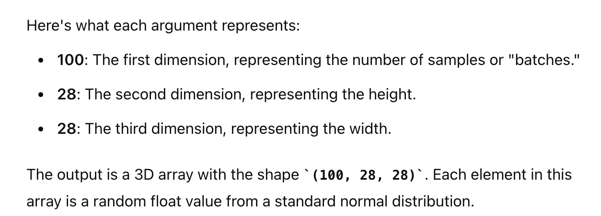

**randint**
create integer of size 100 in the range 0 to 10
```
print(np.random.randint(0, 10, size=100))
```


# code to Shuffle
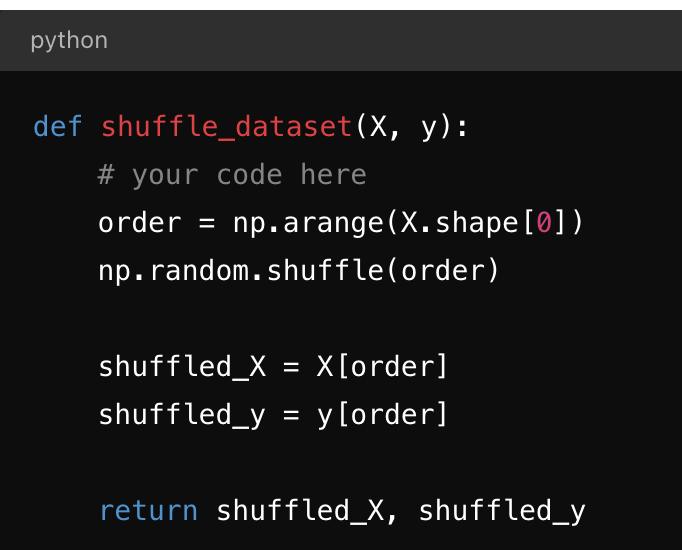

**NOTE**
1. X.shape[0] returns 100 as "A" input used to call shuffle function has 100 samples
2. arange - creates a array of 100
3. np.random.shuffle - has default assignment operator and it shuffles the "order" variable.
4. This order variable is applied to both "A" and "B"


# How function is called?
```
A = np.random.randn(100, 28, 28)
b = np.random.randint(0, 10, size=100)
shuffle_dataset(A, b)
```

# Zero_like
create an array with all zero
```
np.zeros_like(a)
```

# This is amazing!
# ASK
- Create "b" from "a" s.t
- 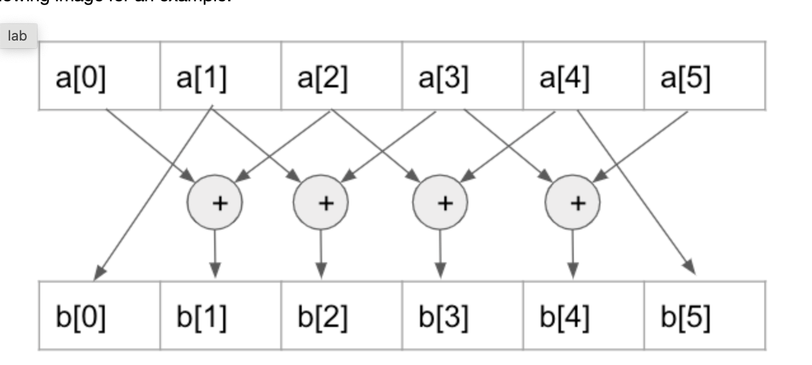

## Logic
- In output, All position except last position , add with next position value (as its zero vector, its an update)
- then add the previous position value from input to the current position in output. (ignore the first value for this update)


# Subtract Each row by mean of the row
 # Given
 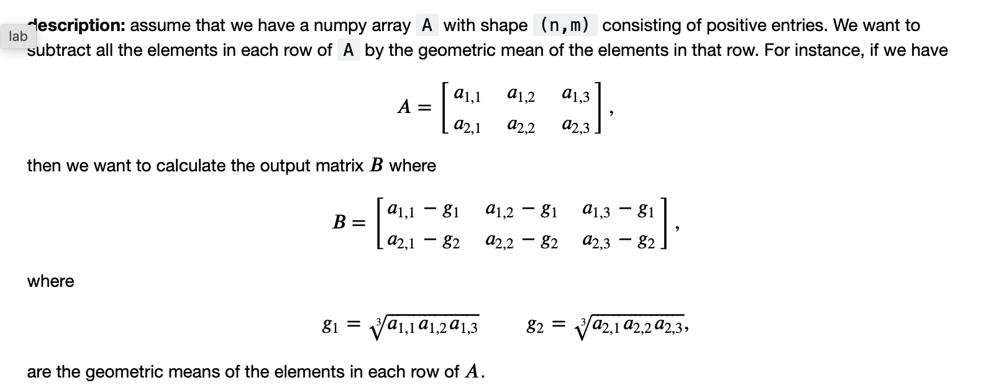

```
 np.exp(np.mean(np.log(A),axis=1)).reshape(-1,1)
 ```

 **Note:**
 A is matrix
 - use log approach to calculate  g1 and g2
 - goal : create a avg. matrix and then subtract with original. avg. matrix always have one column
 - "axis =1" lets the mean function to get average by each row and not total average.
  
  # Rank one array based on another

```
ranking=names[np.argsort(scores)]
```

**Sample:**


**Note**
1. with argsort of "Scores", it generates a ranking for each position. (it starts with 0..)
2. that ranking is what passed to array#2 to sort.

 # Data type
 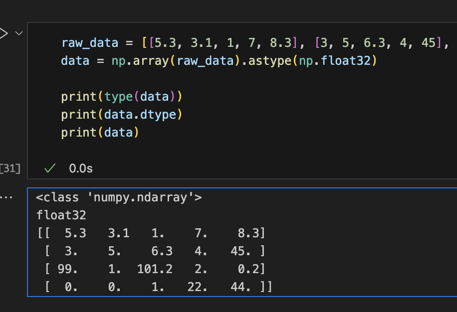
 
 **Note:**
1. type(data) : gives type of array
2. data.dtype = gives elements type

> using ::


# Reverse altenate columns
```
data[:, 1::2] = data[:, 1::2][::-1, :]
```

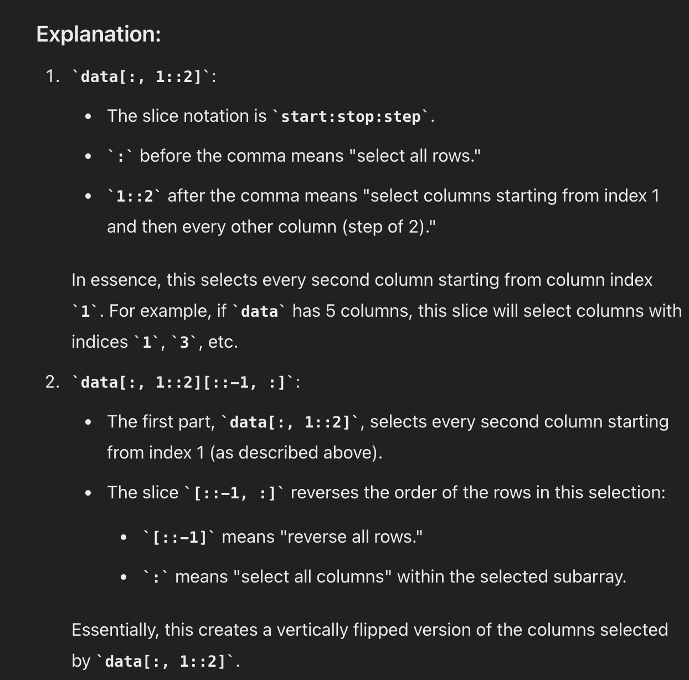

# New axis

```
data_shape_expand_none = data[None]
data_shape_expand_newaxis = data[np.newaxis]
```
-- Any direction


**API - atleast_xD to add new axis**


# Transpose


# concatenate


# Horizontal staacking


# tricks


# where
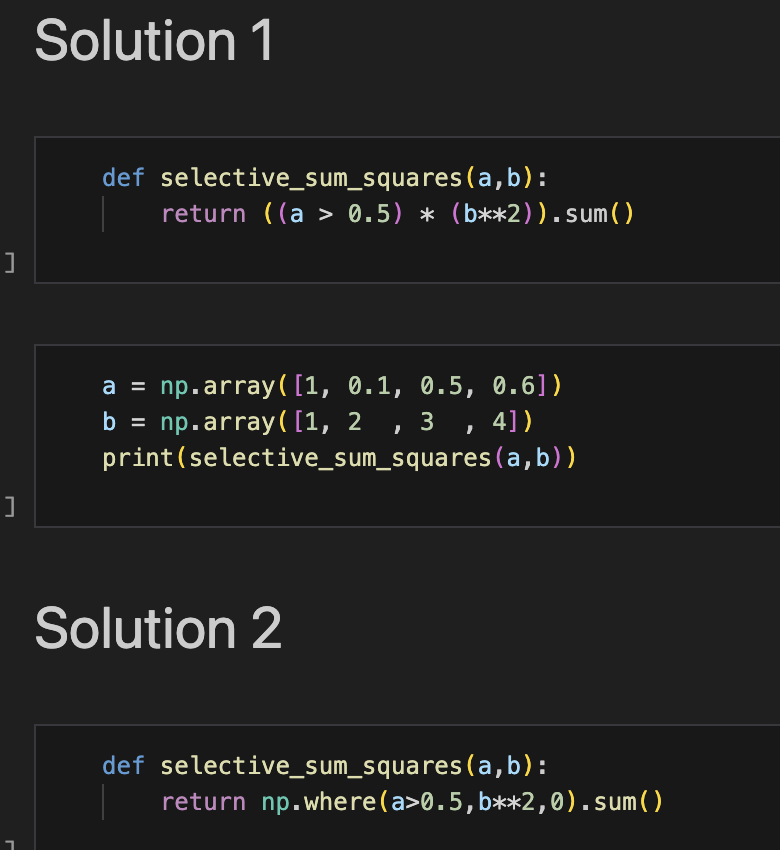

# Advanced
__ASK

