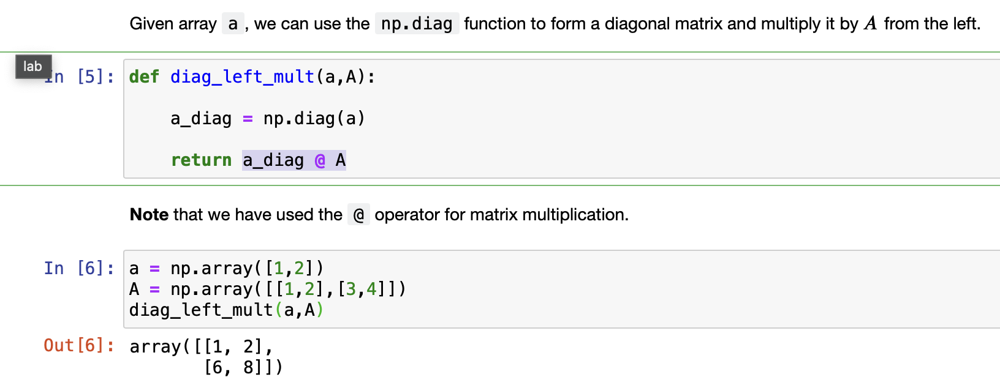
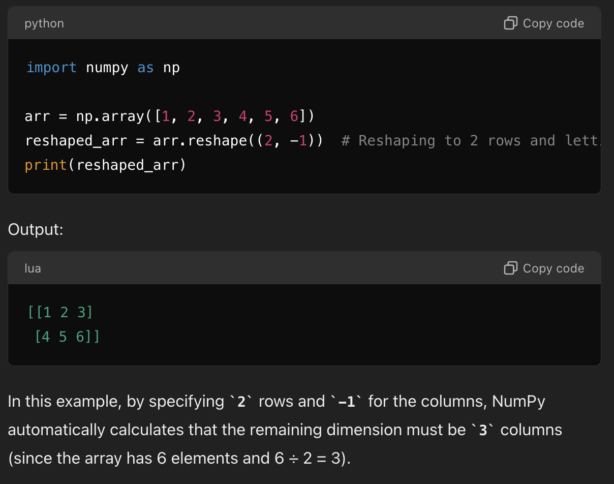
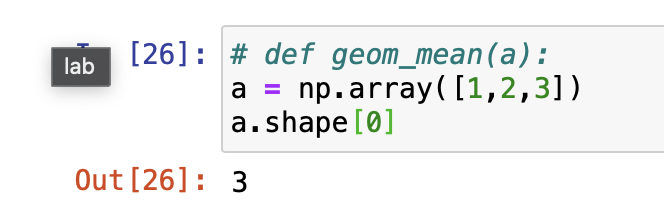
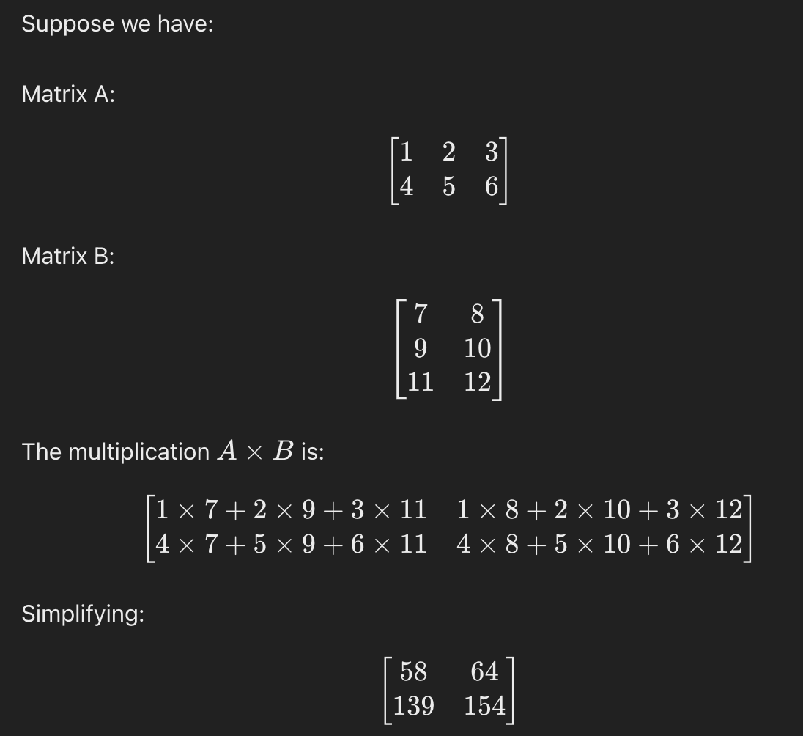
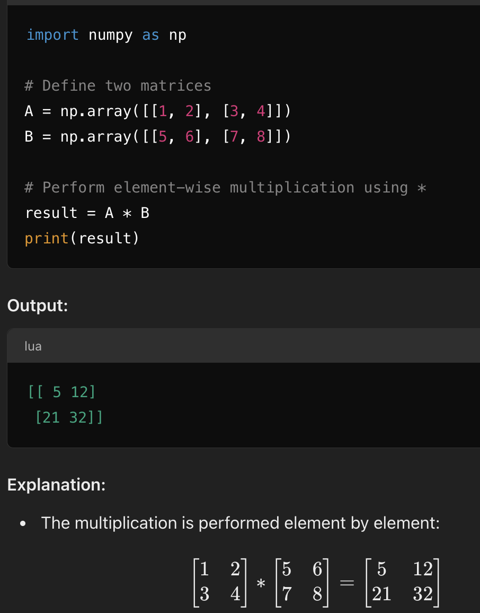
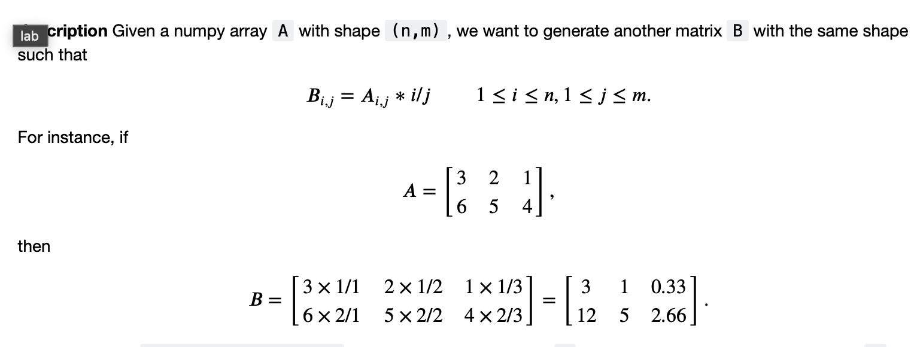

# %matplotlib inline command 
The %matplotlib inline command is a special directive in Jupyter notebooks that tells the notebook to display matplotlib plots inline, directly within the notebook output cells.

When you run this command:

The plots generated by matplotlib will be displayed below the code cells.
You don't need to call plt.show() explicitly to see the plots. 

# Why this code goes infinite
```
fp = 0
while fp != 1:
    fp = fp + 0.1
```

> Due to how floating-point numbers are represented in computers, the value of fp might never be exactly 1.0, 


# Notes Summary
- you should not try to check for exact equivalence (==) with floats. Instead, you can measure approximate equivalence.
- Associative and Distributive property will not work
>> 1.  x, y, z, (x + y) + z == x + (y + z) = FALSE
>> 2. a, b, c, a * (b + c) == a * b + a * c = FALSE

**Create Array**
```
np.array([1,2,3])
```

**Arithment operation**
```
a_mul_b = a * b
a_plus_b = a + b
a_minus_b = a - b
a_div_b = a / b
a_pow_b = a ** b
```

**Array Operation**


**Diagonal matrix and multiplication**
> np.diag(a)
> a_diag @ A (@ is shortcut for multiplication)

*Example*


**Broadcasting Concept**
Reshape

Reshape with -1


**reshape().shape()**
Gives the shape of the array


*Note!!!*

*Use Shape[0] to get shape*

**Matrix Multiplication (@) vs.  Dot matrix (*)**
### Matrix Multiplicaation
> Rule
 >> the number of columns in the first matrix must equal the number of rows in the second matrix.
 *Example*
 

 > This is achieved by "@"
### Element wise Multiplication
> Rule
> > Both arrays must have the same shape or be compatible for broadcasting.
*Sample*


## Numpy Autoscale to fit operations


## Power
Use "**"

## To multiple all elements of one array
```
prod(array)
```

## Square root (Geom_mean)
To achieve

Do..


## Exponents (Multiple to log addition)


> - Multiplication in log is addition
> Square"N" root convert to exp (mean)
From 

to


- Step 3 converts logarithm back to exp.

**What is exp?**

*Sample*


---
# ELEMENTS ADJUSTING/MANIPULATE!
#  Arange
create array starting with "0" and extends to the limit
## ASK:


**NOTE**
- use arrange to create array
- add one as arange starts with 0. use this to create row multipliers and column divisors
- for row multipliers, you should have one column and for column divisors , you should have one row. So use "-1"
  

---
## Basic Indexing
**Step1:Shuffle and setup an array**

**Solution**

*Note*
1. "-5" takes from the last 5 posiitons
## Shuffle
np.random.seed(1)
A = np.arange(100)
np.random.shuffle(A)  # shuffle in place

----