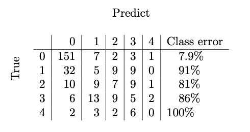

# Lecture 2.1 
> Book: Introduction - Section 1.1 
> Classification: The Big Ideas 
> (p4-p7)
>
> ---

# Classifier

- Procedure that accepts features are inout andn generates "Label" as output
- Two types
```mermaid
graph TD;
    Classifiers-->Binary;
    Classifiers-->Multi-Class;
    Binary-->e.g:_0/1;
    Multi-Class-->e.g:_Laundry-Sorting;
```

# General process
```mermaid
graph TD;
    Training_using_Labelled_data-->Searching_Classifier;
    Searching_Classifier-->optimises_some_cost_function;
```

Note:
(i.i.d = Independent and Identically distributed)
> Training data should be i.i.d of actual data
> > - taken from same source as real data(Identically distributed)
> > - Independant - say in dice roll, always use 52 card for each draw. if draw is top of the previous draw it is skewed.

# Notations
Training dataset = (Xi, Yi) 
Xi = Feature Vector (collection of features)
Yi = Class Label

# Error Rate and Summaries of Performance

| Terminology    | Meaning |
| -------- | ------- |
| Error or total Error rate  | percentage of classification attempts that gave the **wrong** answer    |
| Accuracy | percentage of classification attempts that gave the **right** answer     |
|  Bayes risk     | **minimum** expected error rate obtained with the **best possible classifier** applied to a particular problem    |
|baselines|Hard to get Bayes Risk.compare a particular classifier with some **natural** **alternative**. Called "Baselines"|
|Know-nothing strategy/Comparison by Change|Imagine classifying the data **without using the feature vector** at all—how well does this strategy do? If each of the C classes occurs with the same frequency, then it’s enough to label the data by choosing a label uniformly and at random, and the error rate for this strategy is **1 − 1/C. **If one class is more common than the others, the lowest error rate is obtained by labelling everything with that class. *(e.g 3 classes. So each class error rate is max (1-1/3) =2/3|*

**Note**: If for Binary classification, max possible error rate is 50%. If you have a classifier with higher than that, easiest way to improve it is by switching.

# Detailed Evaluation

## 0-1 Loss Function
- Binary Classification
> If Actual = predict, Loss=0
> > If Actual != predict, Loss=1

| Terminology    | Meaning |
| -------- | ------- |
|False positive rate|percentage of negative test data that was classified positive|
|False negative rate |percentage of positive test data that was classified negative|
|sensitivity(TP Rate)|percentage of true positives that are classified positive|
|specificity(TN Rate)|Percentage of true negatives that are classified negative|

# Class Confusion matrix
> True vs. Predict
> 

> **NOTE**
>> 1. first thing to look at in a table like this is the **diagonal**; if the **largest** values appear there, then the **classifier is working well. **
>> INFERRENCE: e.g above Class 0 Prediction is good. Other Class prediction is not good.

## Over-Fitting and Cross-Validation
| Terminology    | Meaning |
| -------- | ------- |
| **Training error**|error rate on examples **used to train** the classifier. |
|**Test error** |  error on examples **not used to train** the classifier.|
|**overfitting/Selection Bias**| Small Training Error and Large Test error|

## Cross-Validation(To avoid overfitting)

```mermaid
graph TD;
    Dataset-->Training;
    Training-->Training_Larger;
    Training-->Validation_Smaller_Error_Estimate;
    Dataset-->Test;
```

> The error estimate on the **validation** set is the value of a random variable
> because the validation set is a sample of all possible data you might classify. But this error estimate is  **UNBIASED**

**PROBLEM**
1. classifier will **not** be the best possible, because we **left out some training data** when we trained it. 
**Work Around**
- rpeat- edly: splitting data into training and validation sets **uniformly** and at **random**
  **FOLD**
- Each different split is usually called a fold.
**Leave-one-out cross-validation**
A common form of this algorithm uses a single data item to form a validation set. 

---
## Fade out..