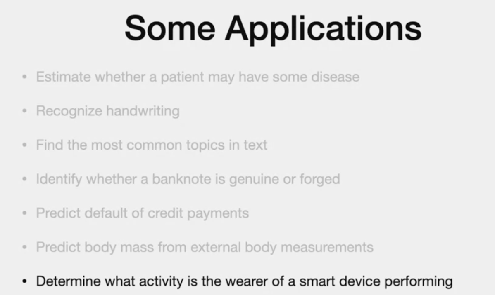
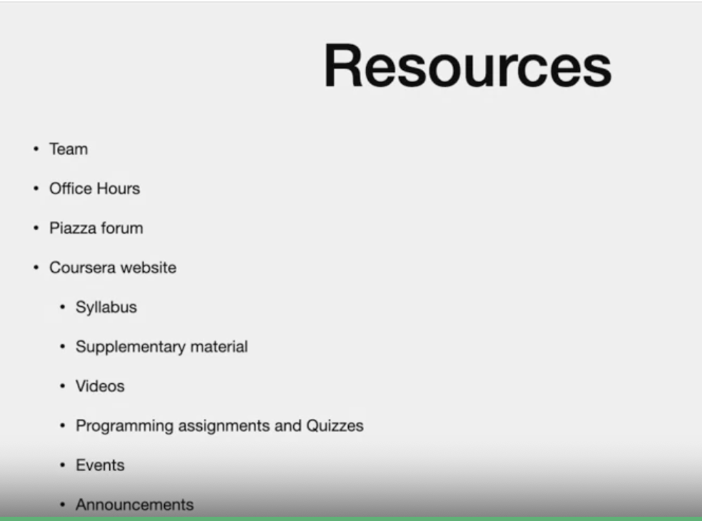

# Course Introduction

# Machine Learning

Machine Learning is a discipline that studies algorithms that while performing some task, improve their performance, as they gain experience.

# What course covers

- ML deals with huge data
- important to deal with Vectorized representation of data
- Loops vs. vector operations
  
# Syllabus

**1. Classification**
- prediction of a new data point to a group
- also, study performance metrics

**2. Regression**
- predict numeric value for unseen data

**3. High Dimensional Classification**
- data with many features
- bring to low dimension
- identify most relevant feature

**4. Clustering**
- same as classification without knowing the groups they belong to

**5. Graphical Models**
- probability models for the processes

**6. Deep Neural Network**
- also use classification
- will use powerful connected structure of simple computational units to solve problem

# Some Applications of ML

- collection of lab test. whether patient have a disease of not.

- OCR - Optimal Character recogniztion - handwritten numbers to digital document 

- Further, find most common topics in text. used in internet to index document.

- Identify banknote detecting fraud.
- body mass based on external measurement of arm
- predict activity of an user based on results of speedometert
..more

- predict source of music
- country by workforce
- eliminiate noise from image (for compression,reconstruction and identify images in a picture)

# Foundation on the course

## Probability
- mean, SD, variance, co-variance, probability distribution and expected values

## Linear Algebra
Matrices, vector, orthonormal ,symmemtry matrix, Eigen value, eigen vectors, matrix decomposition

## calculus
Differentiation, gradient

## Pogramming
Vector computation using numpy

# To Study
- Probability distribution
- Co-variance

# What is expected?

# Resources

# Next...

---
# Fade Out..