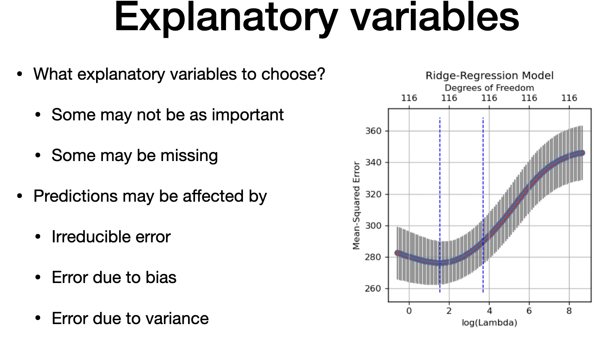
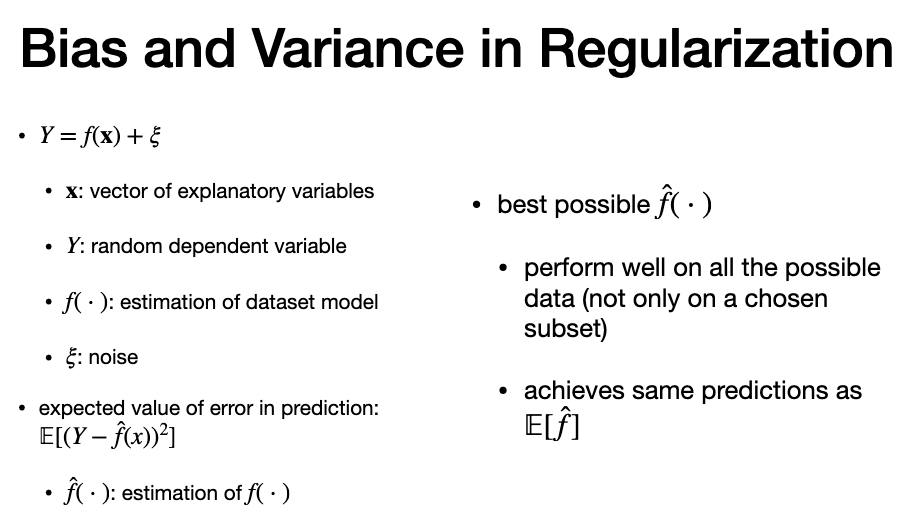
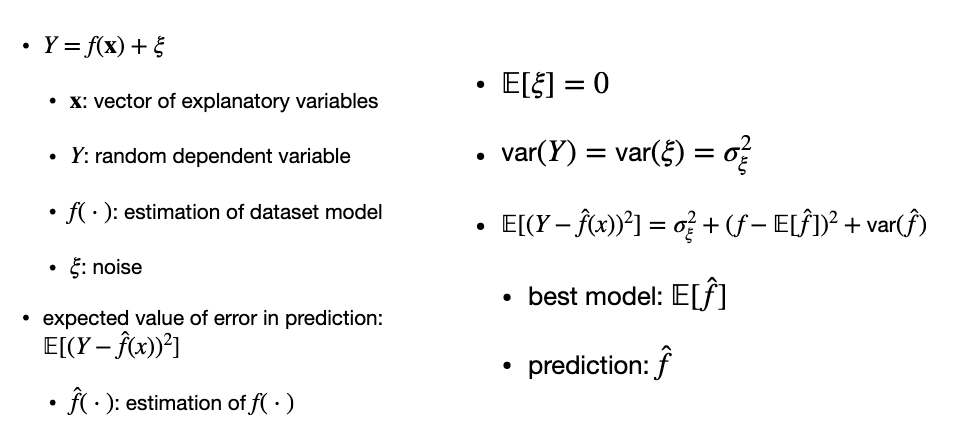
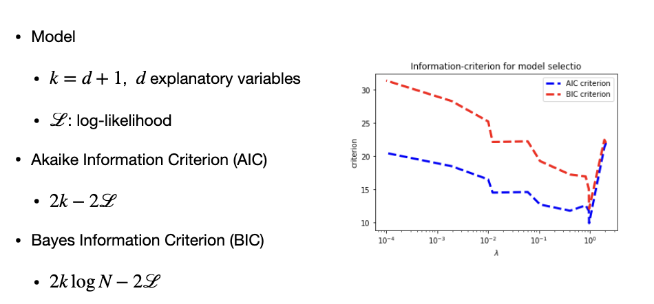
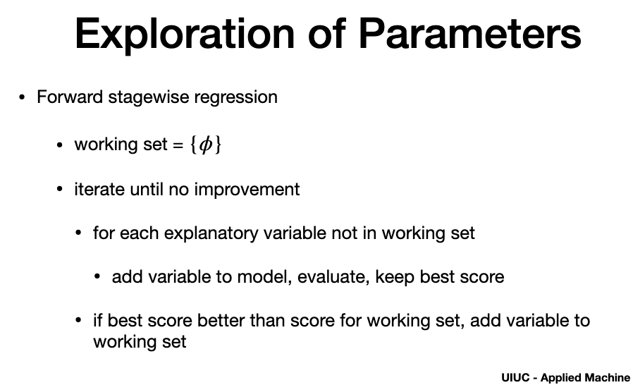
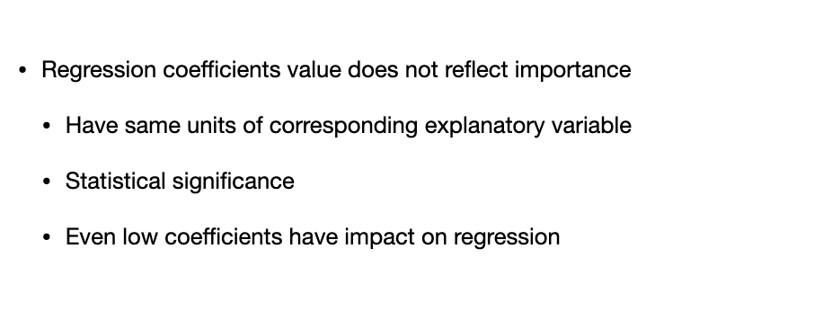

# Agenda

# Abt. explanatory variables

> - we need to identify required explanatory variables from the subset
> 3 kind of errors
> - Bias - underfitting - less variables - simple model and doesnt reflect the data
> - variance - complex models - more variables and specific - not generalize enough - overfitting

# Bias and variance

> - noise is independant of "x"
> - noise - mean of error and variance of sigma squared
> - fhat -> predicion
> "All possible data" - just not on training data
 

> - variance of y is same as noise = sigma squared
>  3 components
> 1. variance of fhat => variance
> 2. bias is (f -Expected value of fhat SQUARED)
> 3. sigma squared => irreducible error

> - explained earlier...

# Choosing model

# AIC , BIC

# Cross- validation

# Exploration of parameters

# Stagewise regression

# variable importance
